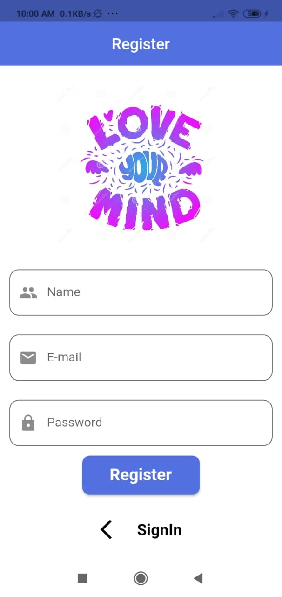
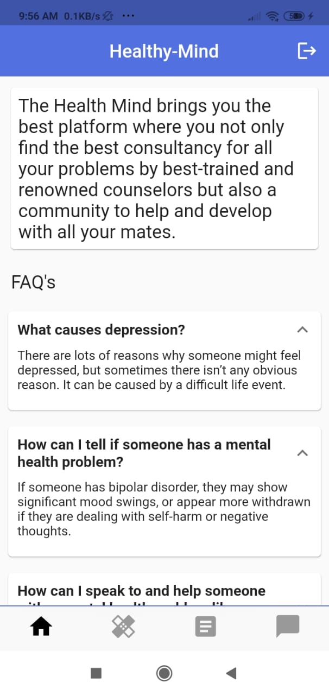
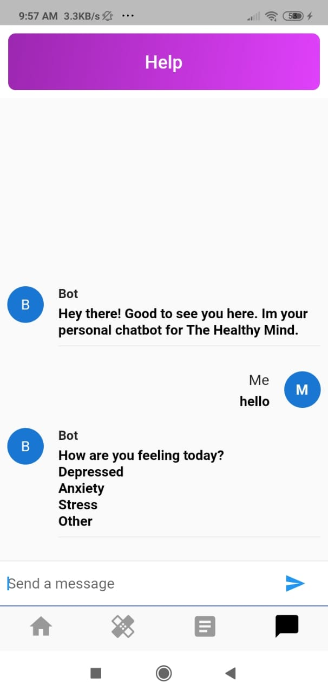
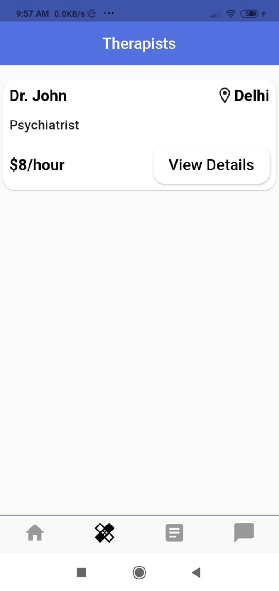
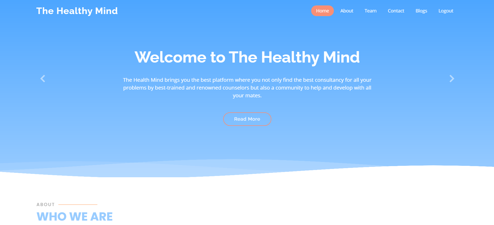
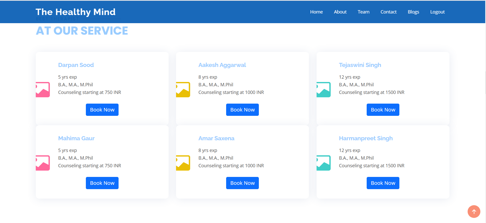
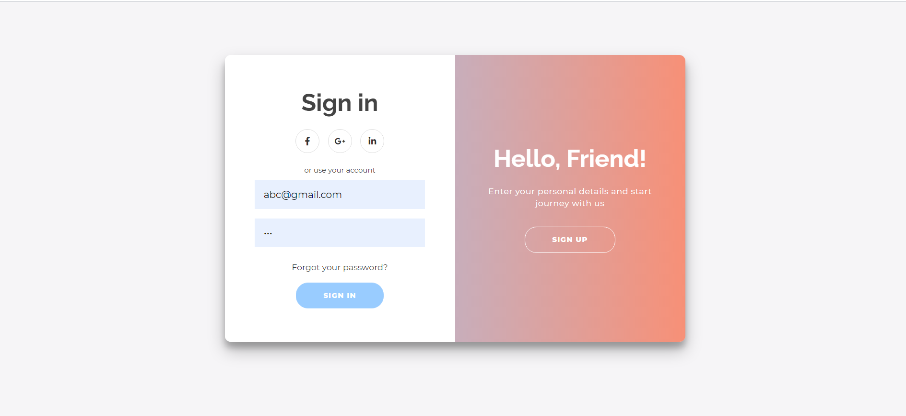

# Suffer Mental Health Care System 🧠 🧑‍⚕️

## Introduction 

Suffer is used most often when talking about dealing with a mental or physical condition for a long time. 

Our Application brings you the best platform where you not only find the best consultancy for all your problems by best-trained and renowned counselors but also a community to help and develop with all your mates.

## Screenshots 

### Mobile Application 
  

|              Registration Screen             |                   Login Screen                     |                    Dashboard                |
|:-------------------------------------------------:|:-------------------------------------------------:|:-------------------------------------------------:|
|  |  |  |

|                Blogs             |                 Chat Bot                   |                    Appointments             |
|:-------------------------------------------------:|:-------------------------------------------------:|:-------------------------------------------------:|
|  |  |  |

  

### Web Application 
 

1. Home Page

  

2. Book an appointment Page

  

3. Journals

  

4. Login/Signup Page

  

## Technologies Used 
1. HTML
2. CSS
3. JS
4. Django 
5. Flutter

## How to run on your system

To run web application(In web app directory):

~~~
pip install django 
python manage.py runserver
~~~

To run mobile application (In mobile app directory)

~~~
cd Mobile
flutter run 
~~~

## Built by developers </> 💻
## Built with ❤️

